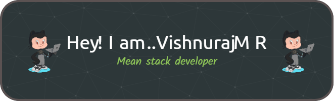

  

<h1 align="center">Hi 👋, I'm Vishnuraj M R</h1>
<h3 align="center">Energised MEAN full stack web developer.</h3>
  

- 🔭 I’m currently working on **An awesome project**

- 🌱 I’m currently learning **Angular,Typescript,nodejs,javascript**

- 👨‍💻 All of my projects are available at [https://github.com/Vishnurajmr1](https://github.com/Vishnurajmr1)

- 💬 Ask me about **Angular,TypeScript,JavaScript,Nodejs,express,MongoDB,PostSQL,Html**

- 📫 How to reach me **vishnurajmr1@gmail.com**

- ⚡ Fun fact **I am always try to learn new technologies because iam a self taught full stack developer.**

<h3 align="left">Connect with me:</h3>

<h3 align="left">Languages and Tools:</h3>

                   

&nbsp;

